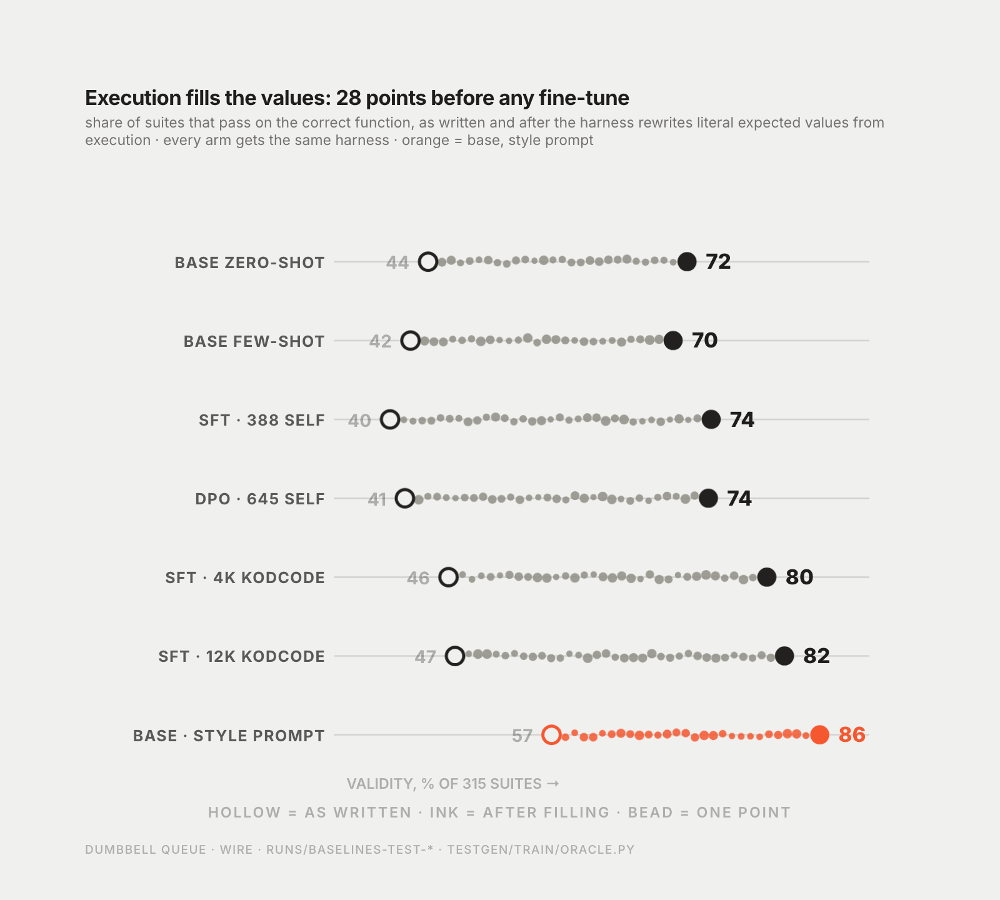

# So I stopped asking it to predict outputs

Experiment 004 · 11 September 2026 · measured · 7 min read

**Summary.** If the model cannot compute expected values, let the harness compute them, in every arm, base included. Filling values by execution was worth 28 validity points on its own. A fine-tune on top of it, on the model's own pairs, was worth +0.024 with an interval that included zero. I pre-registered the bar before the run, and the run failed it.

Three iterations had established that the bottleneck was a capability of the base model. I could keep trying to install it, or I could change the task so it was not needed. A test-writing tool that runs in a CI pipeline has the function right there. It can execute it. Asking the model to predict what the function returns, when the function is one subprocess away, was a constraint I had imposed on myself to make the task pure, and it was the constraint the model could not meet.

So the task changed. The model writes inputs and structure. The harness fills every `assert <expr> == <literal>` from the reference's execution, with no cap on the value's length this time, since the harness owns the values now and there is nothing to teach. Then the filled suite runs on the reference and on the mutants. Both arms, same prompt, same budget, same filling, same mutants. Whatever the fine-tune is worth under that harness, the base gets the same harness, so any gap is the fine-tune.

## What I wrote down first

The metric, and the bar, before any run.

Grounded validity: the suite passes on the reference after filling. Grounded score: the filled suite's mutation score, and zero if the suite is still invalid, averaged over all 315 functions. The zero is what stops a model from winning by writing fewer, safer tests, and it makes the comparison unconditional, so the paired bootstrap runs over every function rather than over whichever subset both arms happened to get valid.

Success: the paired 95 percent interval on the grounded-score difference against the base's zero-shot excludes zero. Secondary rows to report and not to decide on: grounded validity, mutation score on functions both arms got valid, unaided validity (a drop of more than ten points would be a red flag), the held-out arithmetic category, tests and tokens per suite. Two training arms and no more, one test evaluation each, and the ladder stops at the first resolved gain or after the second arm whatever it says.

Also the caveat, in the same paragraph as the metric: a filled assert snapshots the reference. If the reference is wrong the suite enshrines the wrong behaviour. The grounded score measures whether the model's inputs exercise the code, not whether the model can reason about what the code should do. That is what a CI test-writing tool does anyway, and I would rather have it in the design than in a footnote.

## What the harness alone is worth

The first thing I could do cost no GPU time: re-score the test generations I already had. Exploratory, and labelled so, because the metric was chosen after those generations existed.

| arm | unaided validity | grounded validity | mutation score on grounded-valid | grounded score |
|---|---|---|---|---|
| base, zero-shot | 0.438 | 0.717 | 0.842 | 0.604 |
| base, few-shot | 0.420 | 0.702 | 0.854 | 0.599 |
| SFT from entry 002 | 0.397 | 0.743 | 0.846 | 0.629 |
| DPO from entry 003 | 0.441 | 0.698 | 0.854 | 0.596 |

Filling lifts every arm from about 0.43 to about 0.71 validity, by rewriting roughly 1.4 literals per suite. That is the product result of this series and it is not a fine-tune. What remains invalid, 28 percent of suites, fails on inputs and on asserts that are not literals: wrong arity, a call that raises, a `bytes([0])` the harness does not treat as a literal. On average those suites have 2.7 failing tests each.

Two things in this table shaped the second arm. The SFT from 002, which had lost validity unaided, was ahead by 0.024 under the harness, on an interval of [−0.021, +0.070]. Its training data had been selected by kills after filling, so it had been expert iteration on this metric all along, judged on the wrong one. And the DPO from 003, trained to prefer suites that pass as written, was a null here: it had learned not to drift, not to choose inputs.



## The confirmatory arm

Preference pairs again, but built for the new metric. Chosen: the suite that was valid after filling with the most mutant kills, and the assistant turn is the text the model actually wrote, never the corrected one, since the harness fills at inference and I had learned in 002 not to teach corrected values. Rejected: first, suites that were still invalid after filling, which are the bad-input failures the model can actually learn to avoid; then suites with zero kills; then suites at least two kills behind the chosen. 645 pairs from 369 functions, 536 of the rejected being the bad-input kind. Same DPO configuration as 003, 1,218 iterations, checkpoint chosen on dev-171 by grounded score.

The pairs were learnable. Preference accuracy on the 36 held-out pairs went from 0.50 to about 0.70 by the middle of training and the margin kept growing. The dev curve did not follow: six checkpoints between 0.594 and 0.614 against the base's 0.621, suites getting shorter as training went on.

Test, checkpoint 1000, pre-registered:

| arm | unaided validity | grounded validity | grounded score | vs base zero-shot, 95% CI |
|---|---|---|---|---|
| base, zero-shot | 0.438 | 0.717 | 0.604 | |
| grounded DPO | 0.413 | 0.740 | 0.629 | +0.024 [−0.013, +0.064] |

The lower bound does not clear zero. Against few-shot, +0.029 on [−0.015, +0.073]. Grounded validity +0.022, p = 0.41. Mutation score on the 203 both-valid functions +0.005. Unaided validity 0.413, no collapse. Arithmetic probe clean.

The bar was not met, and the ladder stopped there as written.

## What the number means

Two independent training arms, the re-scored SFT and this DPO, landed on the same +0.024. That is not what noise looks like, and it is not what a resolved effect looks like either. The half-width of the interval at n = 315 is about 0.045. A definitive answer to "is +0.024 real" would take around 1,500 held-out functions, and I did not have them.

The preference was learned and did not transfer into choosing better inputs on new functions. I read that as a limit of what the model's own outputs can teach it: the pairs contrast what it did well against what it did badly, and both halves come from the same distribution of inputs it already knows how to produce.

## What this does not say

It does not say the harness idea failed. The harness is the largest single effect in this series, 28 validity points, and it is the thing I would ship.

It does not say a fine-tune cannot help under the harness. It says one trained on the model's own pairs did not help enough to measure at this sample size. Entry 005 changes the data.

## Threats to validity

The four re-scored rows are post-hoc: I chose the metric knowing what those generations looked like. By this entry the same 315 functions had been scored against the same base arm six times, with no correction for that; each interval is honest on its own and the family of them is not. The DPO arm is the only pre-registered number in this entry. Checkpoint selection on 171 functions, single run, single seed. The oracle-tautology caveat above applies to every grounded number in the rest of this series.

The `mlx-lm-lora` DPO loss does not mask the shared prompt in its log-probabilities. I checked the algebra: under the sigmoid loss I used, the prompt terms are identical for chosen and rejected and cancel exactly, so it did not affect this result. It would under other loss types, and I would rather record it than have someone find it.

## How to check this instead of trusting me

```
git clone https://github.com/Catafal/llm-test-generation
uv run python -m testgen.rescore runs/<any test run>      # grounded re-score, no GPU
uv run python -m testgen.stats --grounded <outputs.jsonl> 4b/gdpo 4b/zero
```

The pre-registration is the decision-log entry dated before the run, quoted verbatim in the results document. The grounded pairs, the dev curve and every manifest are committed.

## What I take from this

I had spent three iterations trying to fix in the model something the harness fixes in one subprocess. Changing the task was the decision that mattered most in the project, and it took a null result to make me take it.

Also, and this is the part that stung: the training arm that came closest under the new metric was the very first one, from entry 002, the one I had written up as a failure. It had been optimising the right thing all along. I had been measuring the wrong one.

← [The Harness](index.md)
