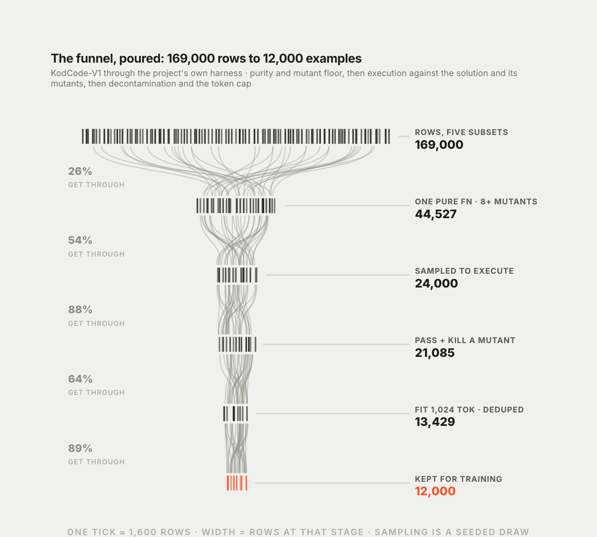
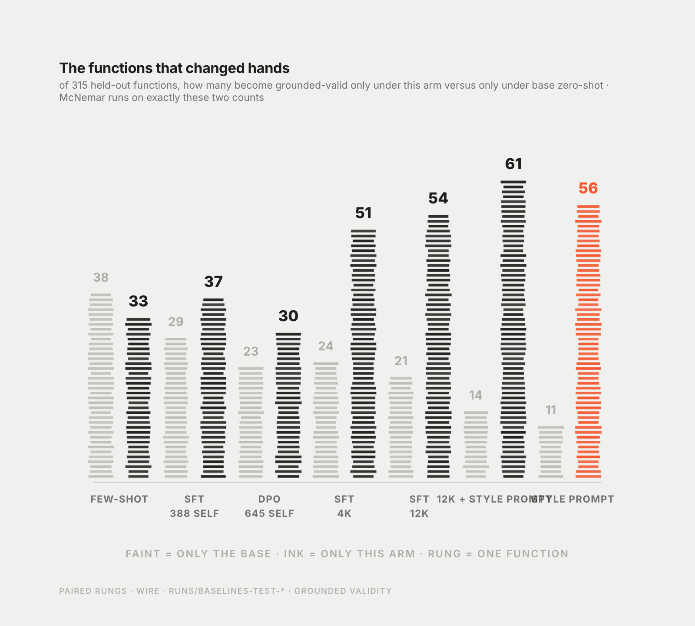
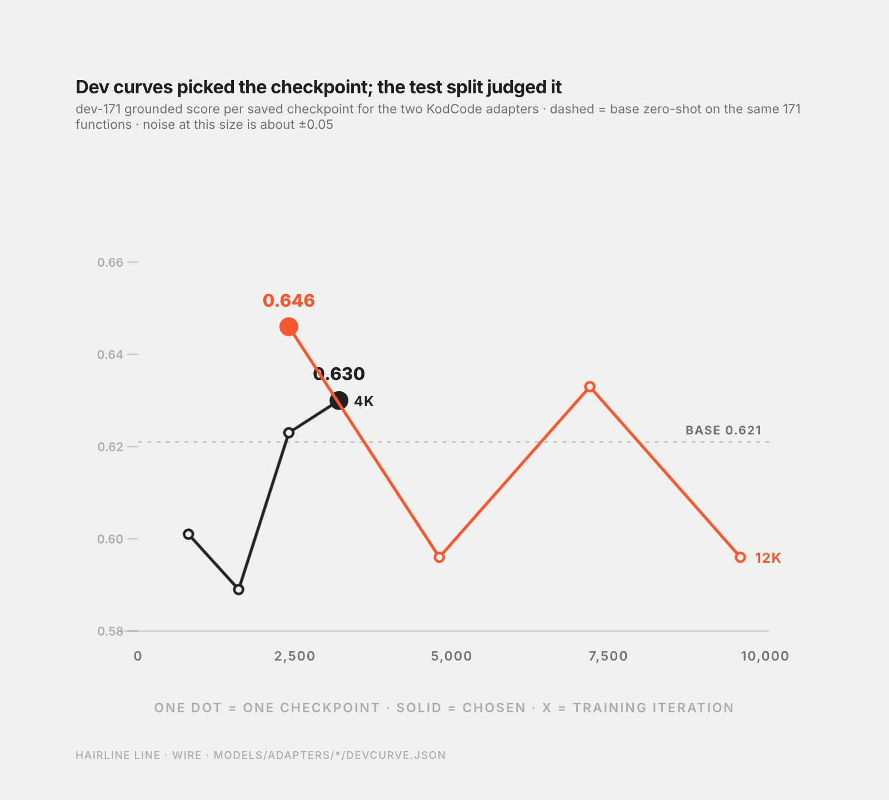
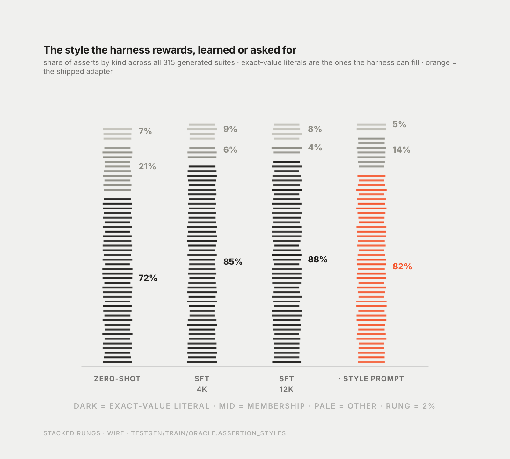

# Four thousand examples from a stronger teacher

Experiment 005 · 14 September 2026 · measured · 17 min read

**Summary.** Three research passes said the recipe was fine and the data was the problem: every working small-model recipe uses a stronger teacher at a scale I had refused on purpose. Four thousand execution-verified examples from a public GPT-4o dataset, curated through my own harness, cleared the pre-registered bar. Twelve thousand replicated the gain and added nothing to it.

After 004 I asked myself a question I should have asked after 002: is this a ceiling of the model, or something I am doing wrong? I do not trust my own answer to that, so I had three research passes done, with the instruction to be sceptical and to cite.

## What the practice review said

The first pass read how the groups that fine-tune small models for real actually do it, from their own reports. Qwen2.5-Coder: 200,000 synthetic instruction pairs. Llama 3: 2.7 million synthetic code examples, filtered by a reward model trained on human labels. Tülu 3: 939,000 prompts. Nemotron Nano 2: about 11 million supervised samples. In every one of them the data comes from a stronger model or a human-trained judge, and at two to three orders of magnitude more than my 388 to 645 examples. No source showed a self-generated loop working at small scale.

The second pass looked for the self-improvement literature directly. The paper that mattered was "Mind the Gap" at ICLR 2025: self-improvement is bounded by the gap between what a model can generate and what it can verify, and that gap scales with pretraining compute and sits near zero for models in my size class. ReST-EM's gains scale with model size. STaR could not bootstrap GPT-2. My four nulls were a flat dose-response from 388 to 645 self-generated examples, which is what that literature predicts.

The third pass audited my recipe line by line against the mlx-lm source and the current LoRA guidance. The adapter scale semantics, the choice of all linear projections, the learning-rate schedule and the optimizer-step accounting, completion-only loss masking, the chat template at training and inference, the checkpoint selection: nothing was broken. Two small things: the DPO rank of 8 sits below the default band, and DPO with no supervised warm start and mostly coarse pairs is a known way to get the "training fits, held-out flat" pattern I had seen. Neither would turn +0.024 into a resolved gain.

So: not a model ceiling, a data ceiling. And the thing I had ruled out in entry 002 on purpose, a stronger teacher, was the only lever with published evidence behind it.

## The ladder

I wrote down three stages, cheapest first, each pre-registered on the same test split with the same success rule as 004, and a stop at the first resolved gain. One: an existing dataset of function and test pairs, curated through my harness. Two: a local 30B-class coder as teacher, sampling suites for my training functions. Three: online reinforcement learning with the harness as the reward. Same base model throughout, because switching base would have confounded the comparison with four earlier iterations.

Stage one survey. Two more research passes over Hugging Face, papers, GitHub and Kaggle. Most of what calls itself a unit-test dataset is Java, or repository-level, or an I/O judge for competition problems. Three survived: KodCode-V1, 487,000 synthetic problems each with a GPT-4o solution and a pytest module verified by execution, licensed CC BY-NC 4.0; NVIDIA's OpenCodeInstruct, five million rows with assert lists, CC BY 4.0; AceCode-87K, MIT, assert lists. KodCode's tests import their function with `from solution import name`, which is my inference format exactly. Every one of the three is model-generated, so stage one was teacher distillation with a frontier teacher at scale, whatever I called it. If that worked, stage two was redundant; if it did not, a weaker local teacher would not do better.

I took KodCode and accepted the non-commercial licence. The adapters inherit it and the notice says so.

## Curation

I did not want to train on KodCode as shipped. I wanted training examples that would have passed my own held-out harvest, so the dataset went through the same filters as my evaluation pool.

Stage A, syntax only, over 169,000 rows from the five subsets that read like utility functions rather than puzzles: the solution must be imports plus exactly one top-level function that passes the same purity filter as the held-out pool, no I/O, no globals, no third-party imports; the test must import only the solution, pytest and the standard library; the test is cut to its first eight functions; the function must yield at least eight live mutants. 44,527 rows survived.

Stage B, execution, on a seeded random sample: the suite must pass on its own solution and kill at least one mutant of a training category. 24,000 sampled, 21,085 passed. 88 percent, which tells you the dataset's own verification is good.

Stage C: n-gram and AST decontamination against both held-out splits, 14 removed; exact-AST duplicates dropped, 7,025; fit within 1,024 tokens, 13,429; then the top 4,000 by mutation score and then by fewer tests. Mean mutation score of the kept set 0.991, 5.7 tests and 644 tokens per example, 89 percent of asserts exact-value literals. Held-out is code written after June 2026 and KodCode is from March 2025, so direct leakage is impossible, and I ran the check anyway.

Why 4,000 and not more. The hybrid base trains at about 35 tokens per second, and I had checked that no newer mlx-lm release had added the missing kernel. Four thousand examples was one epoch in about ten hours. I would rather have one clean point than a run that ends on Wednesday.



## The result

Same recipe as entry 002, same base, one epoch, a checkpoint every 400 iterations, selection on dev-171 by grounded score. Four checkpoints scored 0.601, 0.589, 0.623 and 0.630 against the base's 0.621; the last was chosen.

Test, 315 functions, grounded harness in both arms:

| arm | unaided validity | grounded validity | mutation score on grounded-valid | grounded score | vs base zero-shot, 95% CI |
|---|---|---|---|---|---|
| base, zero-shot | 0.438 | 0.717 | 0.842 | 0.604 | |
| base, few-shot | 0.420 | 0.702 | 0.854 | 0.599 | −0.005 |
| grounded DPO, entry 004 | 0.413 | 0.740 | 0.850 | 0.629 | +0.024 [−0.013, +0.064] |
| KodCode SFT, 4,000, checkpoint 3200 | 0.460 | 0.803 | 0.826 | 0.664 | +0.059 [+0.013, +0.105] |

The lower bound clears zero. Against few-shot, +0.064 on [+0.016, +0.114]. Grounded validity +0.086, McNemar p = 0.002, with 51 functions valid only for the fine-tune and 24 only for the base. Mutation score on the 202 both-valid functions −0.023, [−0.048, +0.001]. Unaided validity +0.022, unresolved. Arithmetic probe: 258 kills against 206, no drift.

The bar was met. Then I ran the second point.




## Twelve thousand

Same pipeline, 12,000 more executed rows, a 12,000-example cut whose mean mutation score was 0.937 rather than 0.991, because the cut reaches further down the ranking. One epoch, about thirty hours. Dev curve 0.646, 0.596, 0.633, 0.596; checkpoint 2400 chosen.

| arm | grounded validity | grounded score | vs base | vs the 4,000 adapter |
|---|---|---|---|---|
| KodCode SFT, 12,000, checkpoint 2400 | 0.822 | 0.667 | +0.062 [+0.015, +0.106] | +0.003 [−0.027, +0.034] |

The gain replicated on an independent sample, curation and training run. Three times the data added nothing measurable. Either this kind of data saturates at a few thousand examples, or the lower selection quality of the larger cut offsets its size; the two are confounded in this design and I have not separated them. The 12,000 model does lean less on the harness, 520 literals rewritten against 798, and its unaided validity is 0.467, still unresolved against the base.



## What the model learned

Style. The adapters write 4.7 to 4.9 tests per suite where the base writes 7.7, and 85 to 89 percent of their asserts are exact-value literals where the base's are 72 percent. Fewer membership asserts, fewer truncated suites. Under a harness that fills literals, that is the optimal style, and the harness rewrote about twice as many values per suite as it did for the base. What remained invalid after filling fell from 89 suites to 62 and 56.

Unaided validity did not resolve. The model did not learn to predict outputs. It learned to write suites the harness can complete, and to choose inputs that exercise more of the code. The loss in mutation score is the price of shorter suites: on the suites each arm gets valid, the adapters kill 0.826 and 0.811 of the live mutants where the base kills 0.842, and on the 202 functions both arms get valid the paired difference is −0.023. The net over all functions is the six points, and it is all validity.

*Correction, 14 September 2026.* The first version of this table listed 0.868 and 0.843 in the mutation-score column for the two adapters. Those were the mutation scores of the suites valid as written, copied from the wrong field of the run summary. The grounded column now shows the values on grounded-valid suites, which the grounded score divides into exactly. Two reviewers caught it by checking that grounded validity times mutation score equals the grounded score, which it now does on every row.

I want to say plainly what this is and is not. It is a replicated, pre-registered, six-point gain in mutants caught per function, under the harness, over the same model prompted. It is not evidence that a 4B model learned execution prediction, and the blog post that claimed it was would be wrong.



## What this does not say

Not that data scale is the lever in general. Scale beyond a few thousand did nothing here. The lever was the source: examples whose expected values were correct by construction, written by a model that can compute them, filtered by execution.

Not that stages two and three were unnecessary in principle. They were unnecessary for this claim. Reinforcement learning with the harness as reward is the one untried angle with a published small-model result behind it, and it is still on the list.

## Threats to validity

Two runs, one checkpoint selection each on 171 functions, one test evaluation each. The intervals are wide; the true effect could be half or twice the point estimate. Selection on mutation score favours simpler functions and the training distribution is synthetic GPT-4o style, which is not the distribution of the held-out pool. Layer-2 embedding decontamination was skipped for this set, on the argument that 2025 synthetic data cannot contain post-2026 GitHub; the n-gram and AST layers ran. The adapters are non-commercial. The gain exists only under the grounded harness.

The 12,000 point confounds scale with selection quality, as above.

## How to check this instead of trusting me

```
git clone https://github.com/Catafal/llm-test-generation
make setup && make sync-models && make models-pull KEYS="4b-bf16"
make adapters-pull
make demo ID="NanmiCoder/open-image-prompts:retrieval/engine.py::weighted_tag_similarity" FROM_RUNS=1
```

The adapters are on the Hub under `jorcagra/qwen3.5-4b-testgen-lora-ext12k` and `-ext4k`, with the model card as their README. The two generation files behind the headline comparison are committed, so the demo replays the exact suites the numbers came from without a model. Generation itself needs Apple Silicon; everything else runs anywhere.

## What I take from this

Five iterations. The recipe was never the problem: the audit found nothing broken, and the run that finally moved used the same adapter, the same layers, the same learning rate as the first one that did not. What changed was who wrote the training examples.

I refused a teacher in entry 002 because I wanted the interesting story. The interesting story was that a 4B model cannot lift itself by its own outputs on a task that needs a skill it lacks, and it took four measured nulls to be able to say that with numbers. The boring story, distillation works, is also true, and it is six points wide.

← [The Harness](index.md)
