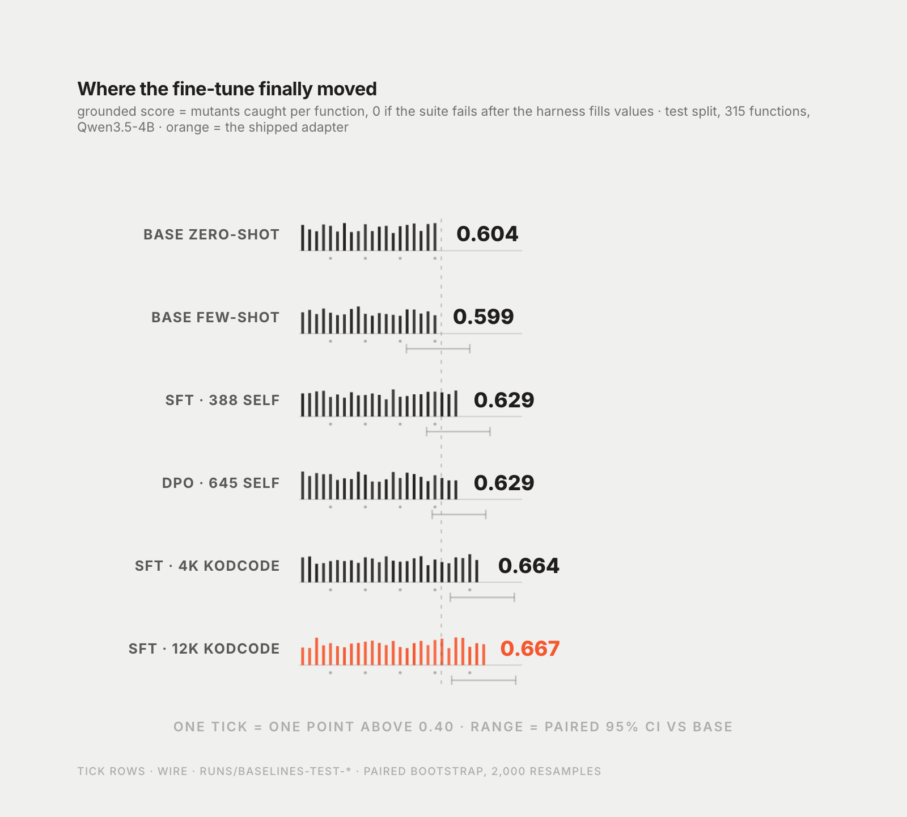

# The recipe was never the problem

Note · 14 September 2026 · reasoned, not measured · 8 min read

**Summary.** Five iterations comparing prompting and fine-tuning on one task. I spent three of them trying to install a capability in a 4B model with a few hundred of its own examples, and one changing the task so the capability was not needed. The gain came from the data source, the harness did more than any fine-tune, and pre-registration saved me more often than it vindicated me.

The project started as a work sample. The question a hiring manager would ask, I thought, was "can you fine-tune a small model and prove it got better?" The honest answer, after two weeks, is yes, and the proof took four failures to construct, and the failures are the part I would show first.

## The one number per iteration

| iteration | signal | examples | source | headline, vs base zero-shot | resolved? |
|---|---|---|---|---|---|
| 1 | SFT on oracle-corrected suites | 388 | own | validity −0.041 [−0.098, +0.013] | no |
| 2 | DPO on own pass/fail pairs | 497 | own | validity +0.003 [−0.048, +0.051] | no |
| 3 | SFT on execution-trace scratchpads | 358 | own | validity +0.054 [−0.010, +0.114], kills −0.070 | no |
| 4 | DPO on own grounded pairs, harness fills values | 645 | own | grounded score +0.024 [−0.013, +0.064] | no |
| 5a | SFT, harness fills values | 4,000 | GPT-4o via KodCode | grounded score +0.059 [+0.013, +0.105] | yes |
| 5b | same | 12,000 | same | grounded score +0.062 [+0.015, +0.106] | yes, and +0.003 over 5a |

Rows 1 to 4 are one experiment repeated with a different signal each time, and the per-assert accuracy of expected values, the thing every one of them was aimed at, never moved. Row 5 is a different experiment: same recipe, different author of the data.

## Three things I would say to someone starting this

**Build the judge before the student, and let the judge have a probe.** The harness, the post-cutoff pool and the paired statistics cost a weekend and they are the reason every null in the table is a result rather than a shrug. The held-out mutation category cost nothing and gave me one sentence, "no operator drift", that I could say five times with a number behind it.

**Read the generations.** Every mechanism in this series came from reading what the model wrote, not from the aggregate. The literal-assert share in 002, the chance-level held-out pair accuracy in 003, the per-test false-failure rate with and without a derivation in 003, the counts of what the harness had to rewrite in 004 and 005. An aggregate null tells you to stop. A mechanism tells you what to change.

**When the model cannot do the thing, ask whether the thing needs doing.** The harness filling expected values by execution was worth 28 validity points, which is more than any fine-tune in the series and more than the two shipped adapters combined. It was available from the first day. I did not take it until three iterations had failed, because I had framed the task as the model's job, and the reframing was a product decision I kept treating as a training one.

## The choice I got wrong on purpose

In entry 002 I chose self-distillation over a teacher because a teacher would have made the result uninteresting. I stand by the reasoning and not the outcome. The reasoning gave me four clean nulls with mechanisms, and the literature I read afterwards says those nulls were predictable: a model this size cannot verify its own outputs well enough to learn from them. Had I read that literature first I would have skipped to entry 005 and had one positive result and no understanding of why the alternatives fail. I do not think the two weeks were wasted, but I would not spend them again the same way, and the difference between those two sentences is the point of writing this note.

## Three times the process caught me

The dev-60 winner's curse in 002: ten checkpoints, sixty functions, the best one seven functions ahead of the base on dev and four points behind on test. I had written "dev at this size is too small" as a risk and used it anyway. Every later iteration selected on all 171.

The dev gap in 003: 0.468 against 0.29, the largest in the series, on a checkpoint that lost kills on test. The dev curve was measuring brevity. I would have shipped that model on the dev number alone.

The pre-registered bar in 004: +0.024, twice, on two arms, with a lower bound that did not clear zero. It would have been easy to run a third arm, or to prefer the secondary metric where the p-value was smaller. The rule I had written down said stop, and I stopped, and the next entry is what made the difference instead.

## What I am not claiming

Not that a 4B model learned to predict the outputs of code. Unaided validity moved from 0.438 to 0.467 across the whole series and never resolved. Everything the adapters gained, they gained under a harness that executes the function for them.

Not that scale is the lever. Twelve thousand examples did what four thousand did.

Not that the harness is a free lunch. It snapshots the reference, so a wrong function gets a suite that enshrines the wrong behaviour, and it fills only literal-equality asserts. The 28 points come with that caveat attached, and the model card says so.

The next thing worth measuring is the one stage of the ladder I never reached: the harness as a reward for online reinforcement learning, on the dense base where rollouts are fast enough. It is the one angle with a published small-model result behind it that I did not try, and it would test whether the model can learn to choose inputs from the harness directly rather than from a teacher's examples.

← [The Harness](index.md)
